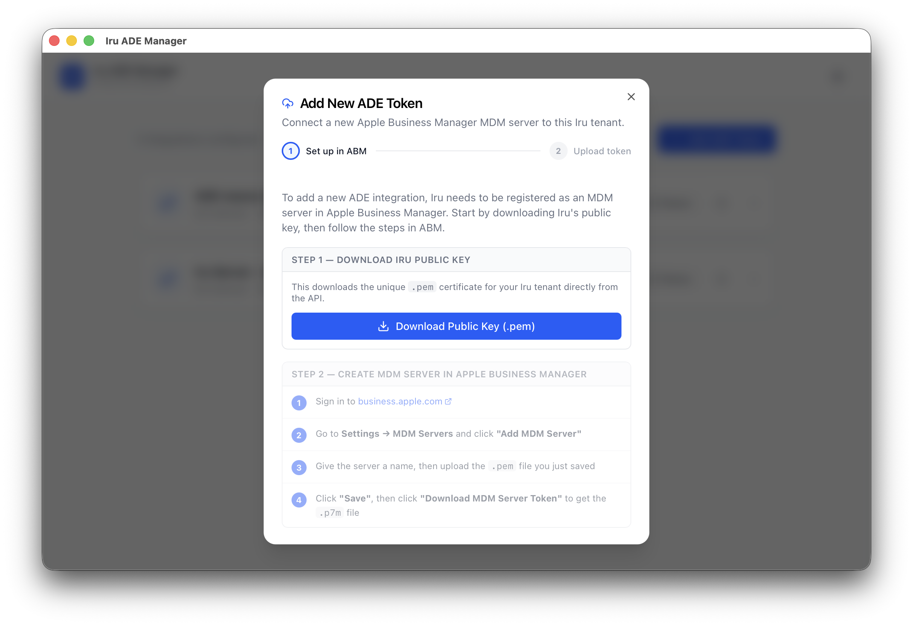

# Iru ADE Manager

A standalone macOS app for IT admins to manage Apple **Automated Device Enrollment (ADE)** tokens in **Iru Device Management** — without leaving the desktop, without a developer toolchain, and without juggling tabs between Iru and Apple Business Manager.

> **A note on naming.** Kandji recently rebranded to **Iru**. This app is named for the new brand, but many URLs, API hostnames, internal identifiers and reference docs still say **`kandji`** — including the API hostname (`kandji.io`) you'll see on the credential screen. That's expected and will stay that way until the platform's rename rolls fully through. Read "Kandji" and "Iru" as the same product.

---

## Why this exists

ADE tokens are how MDM platforms (Iru, Jamf, Kandji, Mosyle, Intune…) get authorised by Apple Business Manager to auto-enrol Mac, iPhone and iPad devices the moment they're unboxed. Each token is:

- **Tied to one MDM server in ABM** — one Iru tenant typically uses several.
- **Annual** — every token expires 365 days after upload and must be renewed before then, or new devices stop enrolling.
- **Single-use** — the `.p7m` token Apple gives you can be uploaded **once**. If a renewal fails partway through, you have to go back to ABM and download a fresh one.
- **Fiddly to manage in-product** — Iru's web UI works, but for admins running a fleet across multiple tenants/regions or rotating tokens at scale, it's slow and the API has half a dozen undocumented quirks.

This app collapses the whole workflow — *add token, renew token, see what's expiring, see which devices each token owns, fix a wrong blueprint/user* — into a single signed `.app` you drop into `/Applications`.

## What it does

- **List every ADE token** in your Iru tenant with colour-coded expiry badges (red ≤ 30 days, amber ≤ 90 days, green > 90 days).
- **Add a new ADE token** via a guided 2-step wizard: download Iru's public key, paste it into ABM, upload the resulting `.p7m`.
- **Renew an expiring token** with a single dialog — same wizard, ABM-first instructions baked in.
- **Drill into a token** to see all devices currently enrolled through it, with blueprint UUIDs resolved to human-readable names.
- **Edit a device** — change blueprint, asset tag or assigned user without leaving the app.
- **Delete a token** when an MDM server is decommissioned in ABM.
- **Multi-tenant ready** — switch credentials at any time via Settings → Change Credentials.
- **Region-aware** — supports both US (`<subdomain>.api.kandji.io`) and EU (`<subdomain>.api.eu.kandji.io`) tenants.

## Security

- Bearer API tokens are stored in the **macOS Keychain** (via the `keyring` crate) and **never cross IPC into the WebView**. All Iru API calls are made from the Rust backend with the token read directly from Keychain inside each command handler.
- Signed under **Developer ID Application** and **notarised + stapled** by Apple — no Gatekeeper bypass needed on first launch.
- `.p7m` token bytes are read in-memory and POSTed straight to Iru. Nothing is written to disk except the public-key `.pem` you choose to save during the add/renew wizard.

## Install

1. Download the latest DMG from [Releases](https://github.com/dhaataalimited-hub/iru-ade-manager/releases/latest).
2. Open the DMG and drag **Iru ADE Manager** to `/Applications`.
3. Launch it. macOS will not show a Gatekeeper warning — the app is fully notarised.

> **Note:** the v0.1.0 build is **Apple Silicon (aarch64) only**. An Intel/universal build is on the backlog.

## First-run setup

On first launch you'll be asked for three things:

| Field | Where to find it |
|---|---|
| **Subdomain** | The first part of your Iru API URL — for example, in `https://`***`yourtenant`***`.api.kandji.io` the subdomain is **`yourtenant`** |
| **API Bearer token** | Iru → **Settings → Access** → API Token (needs read+write scope on devices and integrations) |
| **Region** | **US** → `https://<subdomain>.api.kandji.io` **EU** → `https://<subdomain>.api.eu.kandji.io` |

You'll find the API URL in your Iru tenant under **Settings → Access**. The hostname still uses `kandji.io` (see the naming note at the top).

Click **Test & Save** — the app makes a single `GET /devices?limit=1` round-trip to verify the credentials before storing them in Keychain.

## Daily usage

- **Add token:** click `+ Add ADE Token` → click `Download Public Key (.pem)` → save it → in ABM, create the MDM server, upload the .pem, download the .p7m → drop the .p7m into the app's upload zone → done.
- **Renew token:** expand a token row → `Renew` → ABM instructions appear → upload the new .p7m. ⚠️ If you get an error mid-way, you must download a **fresh** .p7m from ABM — the previous one is now consumed.
- **Edit a device:** expand a token → click ✏️ next to the device → change blueprint / asset tag / user → Save.
- **Switch tenants:** Settings (gear icon) → Change Credentials → app returns to the first-run screen.

## Status

- **v0.1.0** — released May 2026.
- Tested end-to-end against a live Iru tenant.
- Apple Silicon only; Intel/universal binary planned.

See [CLAUDE.md](./CLAUDE.md) for full project context, architecture decisions, the eight Iru API quirks the app encodes, and the build/sign/notarise workflow.

## License

Personal/internal use. No license has been specified — contact the author before redistributing.
